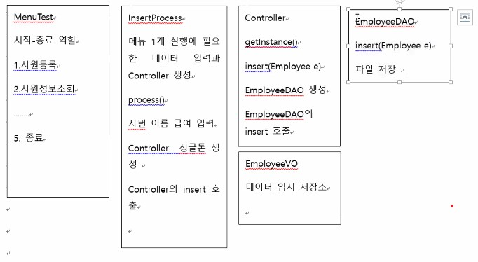

## 시험 규칙

- 5시부터 8시까지 시험 진행
- 러닝클라우드 사이트에 접속
- 6시 이후 줌 끄고 나머지 시험
- 과제 1 압축, 과제2 압축 을 또 전체 압축

---


- ##### 정형 매개변수

  ```java
  class A{
      int add(int i, int j) {return i+j;}
      String add(String i, String j){ return i+j;}
      void add(double i, double j){    } // 가능
      void add(Object o1, Object o2){ o1.toString() + o2.toString(); }// 가능
      void add(int a, int b){ a+b; } // 첫번째랑 매개변수 리스트가 같아서 불가능
      void add() {} // 가능
      int add() { return 0;} // 바로 위랑 매개변수 리스트가 동일해서(둘다 빈칸) 불가능
      void add(int a, String s) {} 
      void add(Strings, int a){} // 바로 위와 매개변수 리스트가 비슷해 보이나 순서가 다르므로 가능하다
  }
  ```

  

  - add (1,2)를 통해 정수 3을 출력하는 메소드가 있을때
  - add("jj","aa")를 하면 string "jjaa" 출력
  - 메소드의 매개변수의 형태가 다른 형태를 overloading
  - overloading은  1개의 클래스에 동일한 이름의 메소드가 여러개 있다. 그때 매개변수 리스트는 다르게 정의해야 한다. (리턴타입이나 modifier는 상관 없다.)


- 비정형 매개변수

  ```java
  A a1 = mew A();
  a1.add(1,2) => 정수 2개;
  a1.add(1,2,3,4,5) => 정수 5개;
  a1.add(1,11,111,1111,11111,1111111,1111111) == 정수 여러개;
  a1.add(정수 타입 정하고, 개수는 안정하고) ==> 비정형 배개변수 형태를 쓰고 싶다;
  
  class A{
      add( int ... numbers){ // int형으로 여러개로 매개 변수로 사용
          
      }
  }
  ```

  

- main

  ```java
  static public void main(String[] args){
  
  }
  /* 규칙
  1. static public은 순서 바꿀 수 있다
  2. void main은 절대 다른걸로 교체 불가능
  3. String도 int형태로 바꿀수 없다
  4. args 대신 다른걸로 바꿔도 되긴하다
  5. String ... args로 변경 가능
  ```

  - main 메소드에 세부 메뉴 실행 입력과 처리 데이터 등을 구현하지 않는 것이 좋다


- Singleton dao dto

  - 수정, 재사용이 편리하기 위해서 나누는 작업
  - DAO : Data Access Object의 약어, 주로 파일을 출력하는 코드에 쓴다
  - DTO : Data Transfer Object의 약어, 데이터를 임시로 저장해서 다른 클래스에 전달해주는 역할을 위해 쓴다. 개발자 따라 VO ( Value Object ), DO(Data Object)로 쓰이기도 하다

  - Controller : 

    - 전체를 연결해주는

    - ex) 사원을 등록 할 때 ====> 등록이 필요한 데이터를 입력 ===> EmployeeDAO에 저장 ====> EmployeeVO에 저장  ( 입력 ) =====> Controlloer ====> ManagerDAO() ====>ManagerVO ( 실행 )

      중간에서 위의 역할을 하게 해주는게 Contrlloer이다.

    - 누구랑 누구를 연결해 줄것인지 제어

  - InsertProcess : 

    - 추가적인 입력이 필요한 경우를 위해 

    ​				


